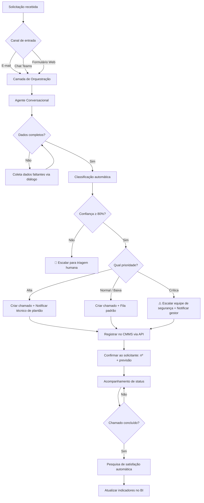
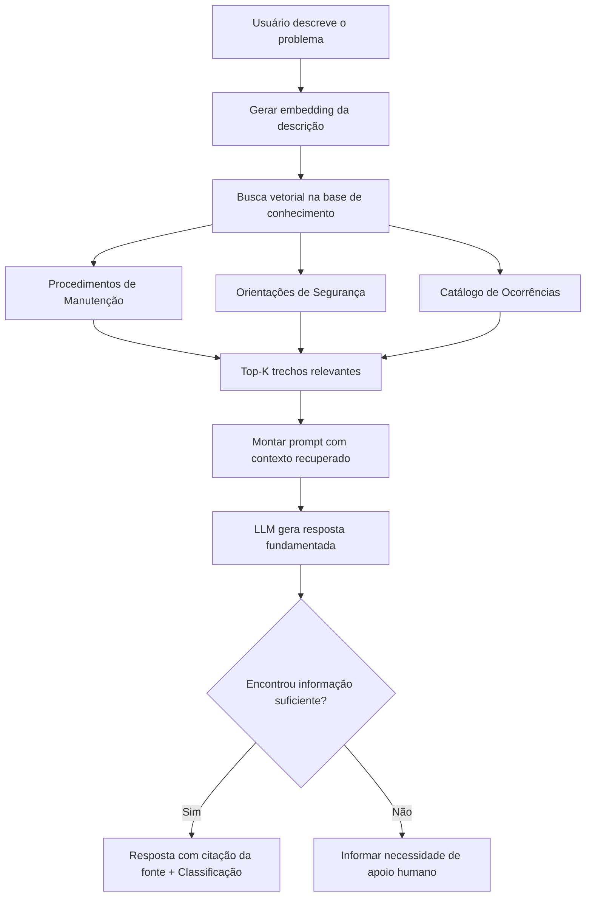
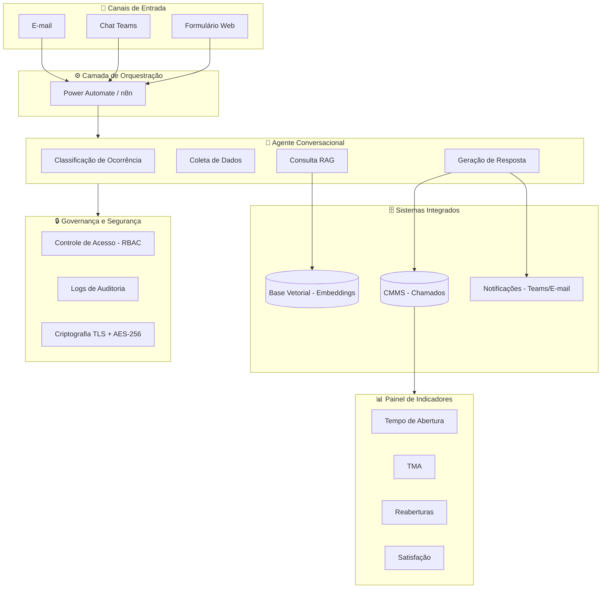
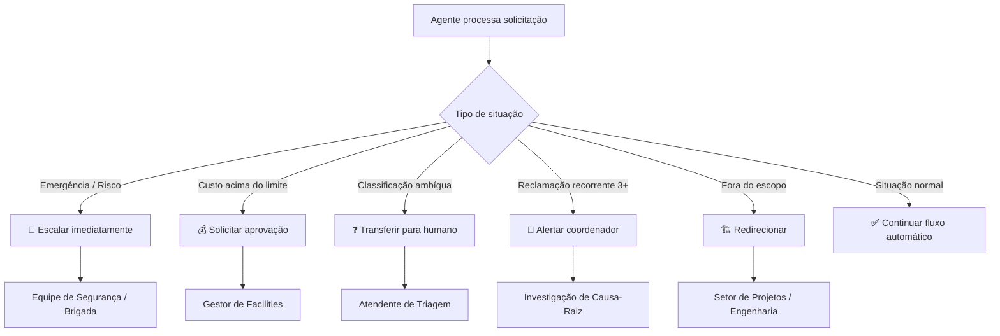
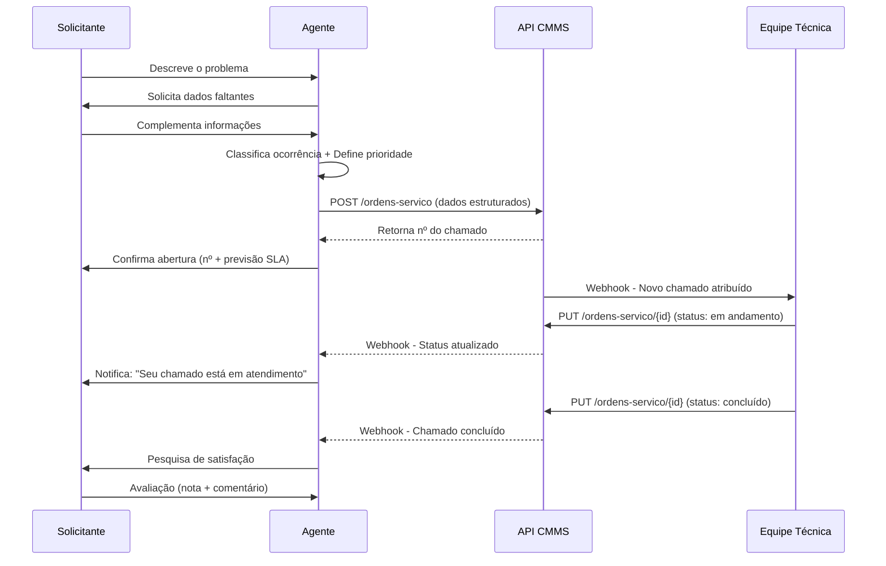

# Fluxogramas Mermaid — Agente de Manutenção Predial

> Cole os blocos abaixo no Obsidian dentro de blocos ` ```mermaid ` para renderizar.

---

## 1. Fluxo Geral do Agente (Triagem e Encaminhamento)



---

## 2. Fluxo RAG (Retrieval-Augmented Generation)



---

## 3. Arquitetura Geral do Sistema



---

## 4. Fluxo de Participação Humana (Escalação)



---

## 5. Fluxo de Integração com CMMS



---

## Como usar no Obsidian

1. Certifique-se de que o plugin **Mermaid** está ativo (já vem nativo no Obsidian).
2. Copie qualquer bloco acima (incluindo ` ```mermaid ` e ` ``` `).
3. Cole em uma nota `.md` no Obsidian.
4. Alterne para o modo de leitura (Preview) para ver o diagrama renderizado.
